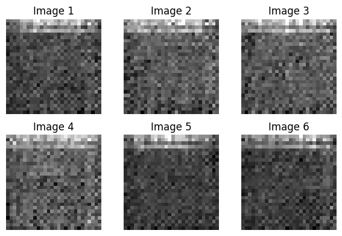
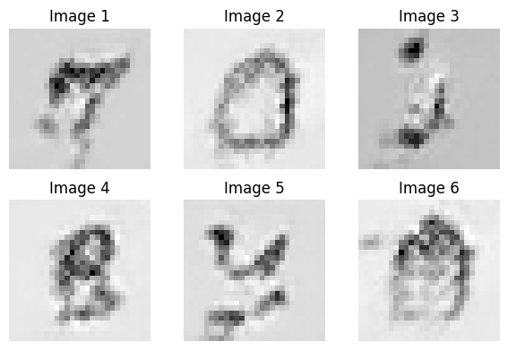
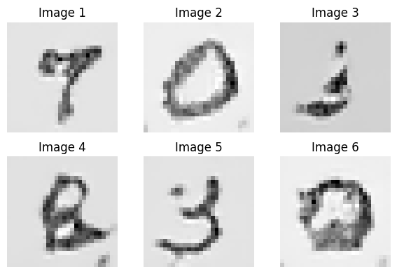
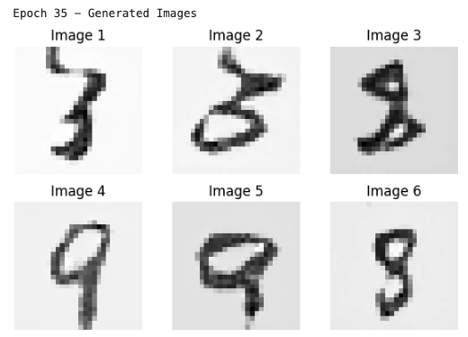

# GAN for Generating Handwritten Digits #
Learning how to implement a Generative Adversarial Network (GAN) using PyTorch Lightning to generate handwritten-style images.

This repository contains an implementation of a Generative Adversarial Network (GAN) using PyTorch Lightning to generate handwritten-style images. The project focuses on training a GAN with a simple generator-discriminator setup, tracking training progress with plotted images every 5 epochs, and testing the generator with random noise input.

  <table>
    <tr>
      <td>
      <td>
      <td>
      <td>
    </tr>
  </table>

# Skills Covered & Concepts Learned #

🔹 Generative Adversarial Networks (GANs) – Understanding adversarial training dynamics between the Generator and Discriminator.

🔹 PyTorch Lightning – Structuring deep learning models efficiently using the Lightning framework.

🔹 Custom Training Loops – Implementing manual optimization with self.optimizers() for multiple optimizers.

🔹 Loss Functions – Using Binary Cross-Entropy Loss (BCE) for adversarial training.

🔹 Model Evaluation & Visualization – Generating images after every 5 epochs and manually testing the generator with random noise.

🔹 Deep Learning Optimization – Training using Adam optimizer and improving training efficiency.
